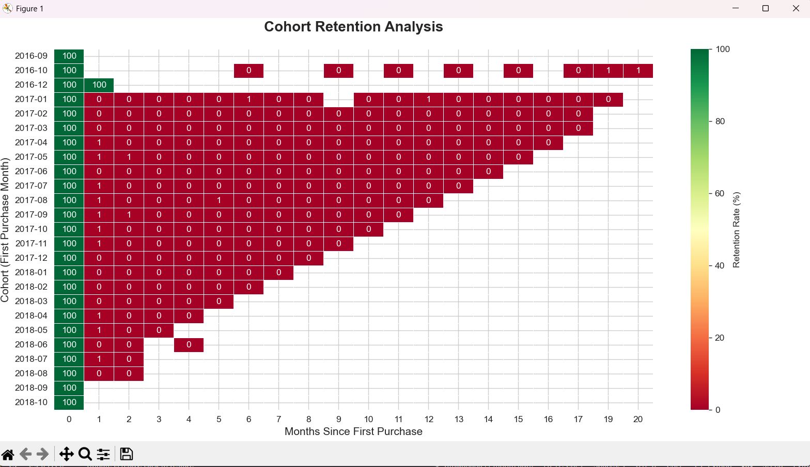
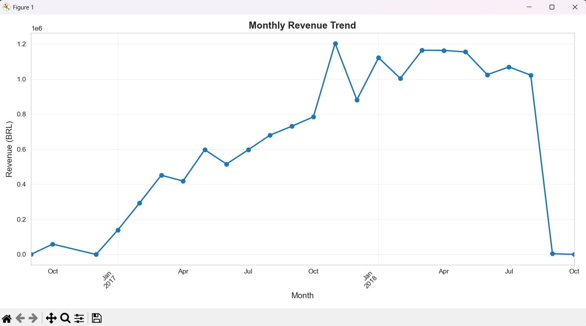
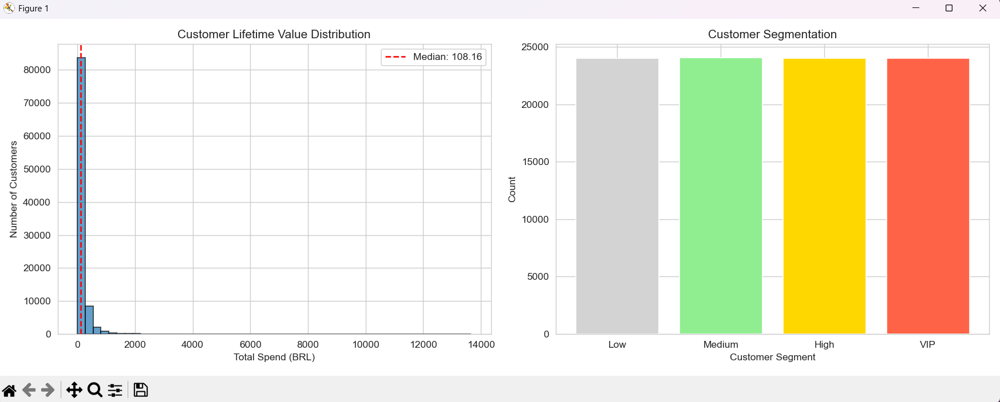
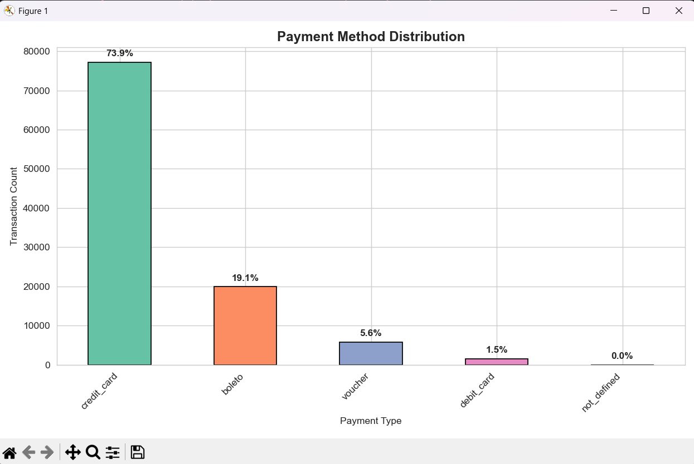
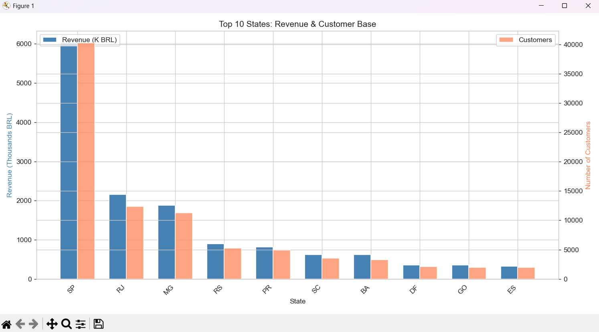
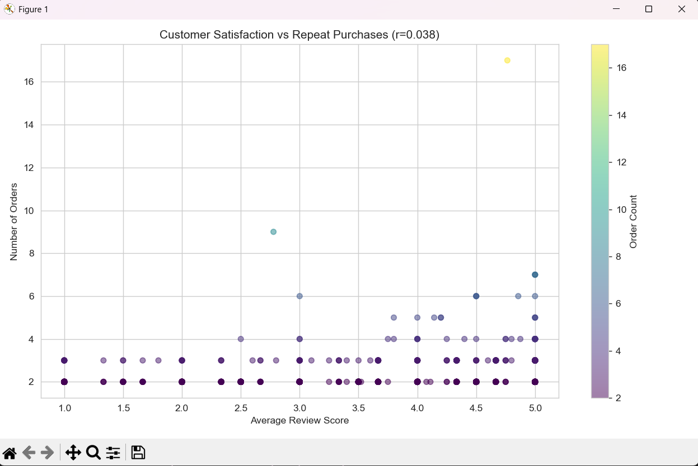
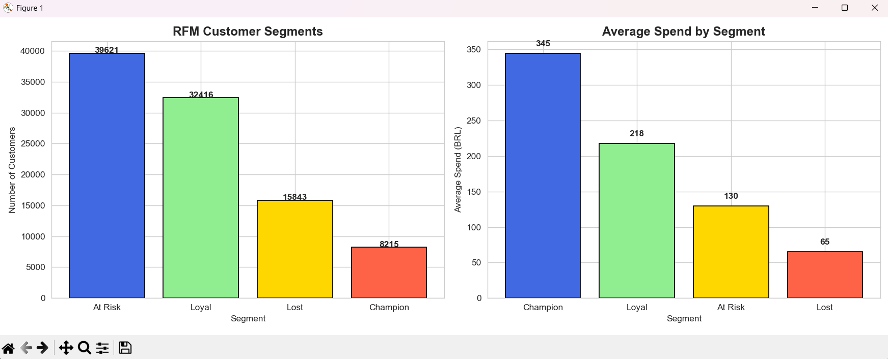

# Scalable E-Commerce Analytics Pipeline

> **A serverless AWS data pipeline and Python engine processing 100k+ records across 8 relational datasets to optimize Customer Lifetime Value (CLV) and Retention.**


---

## 📊 Project Overview

| Metric | Value |
|---|---|
| **Status** | ✅ Complete |
| **Records Processed** | 100k+ across 8 relational datasets |
| **Tables Joined (Python engine)** | 4 — orders, payments, customers, reviews |
| **Cloud Region** | AWS (Mumbai) |
| **Analyses** | 7 |
| **Visualizations** | 7 |
| **Dataset** | [Olist Brazilian E-Commerce](https://www.kaggle.com/datasets/olistbr/brazilian-ecommerce) |

---

## 🎯 Business Impact & Strategy
This project transitions from local data processing to a **Cloud-Native Architecture**, simulating the scalability required in high-volume retail environments:

* **Retention Engineering:** Created a **Longitudinal Cohort Matrix** to identify exactly when customers "drop off," providing a quantitative baseline for automated re-engagement.
* **Predictive Segmentation:** Automated an **RFM (Recency, Frequency, Monetary) Model** to segment 90k+ unique identities, isolating a "Champion" group that generates **4x the average revenue**.
* **Cost-Optimized Scalability:** Architected a serverless Data Lake on **AWS**, decoupling storage from compute to enable high-velocity SQL querying with **near-zero infrastructure overhead**.

---

## 📁 Project Structure

```
Scalable-E-commerce-Analytics-Pipeline/
├── ecommerce_analysis.py      # Full analysis pipeline (load → merge → 7 analyses)
├── visualizations/            # Generated charts (output of the pipeline)
│   ├── monthly_revenue.png
│   ├── customer_segments.png
│   ├── payment_methods.png
│   ├── geographic_analysis.png
│   ├── satisfaction_correlation.png
│   ├── cohort_retention.png
│   └── rfm_segments.png
├── docs/
│   └── PROJECT_SUMMARY.md     # Methodology deep-dive and detailed findings
├── .github/workflows/ci.yml   # Data quality / pipeline validation CI
├── requirements.txt
└── README.md
```

---

## 🚀 Quick Start

### Local Workflow (Python)
1. **Clone the repository**
   ```bash
   git clone https://github.com/rithikahaha/Scalable-E-commerce-Analytics-Pipeline.git
   cd Scalable-E-commerce-Analytics-Pipeline
   ```
2. **Get the data** — download the [Olist Dataset from Kaggle](https://www.kaggle.com/datasets/olistbr/brazilian-ecommerce) and place `olist_orders_dataset.csv`, `olist_order_payments_dataset.csv`, `olist_customers_dataset.csv`, and `olist_order_reviews_dataset.csv` in the project root.
3. **Install dependencies**
   ```bash
   pip install -r requirements.txt
   ```
4. **Run the pipeline**
   ```bash
   python ecommerce_analysis.py
   ```
   Charts are written to `visualizations/`; an executive summary (total revenue, order count, repeat customer rate) prints to the console.

### Cloud Workflow (AWS)
Upload `raw_data/` to **S3** → run the **Glue Crawler** to populate the Data Catalog → query via **Athena** SQL.

---

## ☁️ CI/CD Pipeline

This project includes an automated CI pipeline using **GitHub Actions** that runs on every push to `main`.

**Automated checks on every commit:**
- Dependency validation — confirms all libraries load correctly
- Function existence check — verifies core pipeline functions are present
- Schema validation — checks required columns exist in the data
- Null value detection — flags missing data in critical fields
- Data integrity check — catches negative payment values

---

## 🛠️ Tech Used

| Category | Tools |
|---|---|
| **Cloud Storage** | Amazon S3 — scalable object storage for the 8-table Data Lake |
| **Cloud ETL** | AWS Glue — serverless crawlers for cataloging and schema discovery |
| **Cloud Query Engine** | Amazon Athena — interactive ANSI SQL directly over S3 |
| **Data Processing** | Python, Pandas, NumPy |
| **Visualization** | Matplotlib, Seaborn |
| **DevOps** | GitHub Actions (CI), Bash |

---

## ⚙️ Technical Implementation

**1. Cloud Data Engineering (AWS - Mumbai Region)**
* **Storage:** Established a centralized landing zone for 8 datasets (Orders, Payments, Customers, Reviews, etc.) ensuring 99.999999999% durability.
* **ETL Logic:** Orchestrated Glue Crawlers to automatically populate the **Glue Data Catalog**, creating a structured metadata layer for the raw CSVs.
* **Serverless SQL:** Optimized Athena queries for "Frugality" by using column projection to minimize data scanned per query.

**2. Analytics Pipeline (Python)**
* **Data Wrangling:** Executed multi-key joins across sources to create a **Single Source of Truth**.
* **Modeling:** Developed custom logic for **Cohort Analysis** and **RFM Statistical Binning** using `pd.qcut`.

Full methodology and per-analysis breakdown: **[docs/PROJECT_SUMMARY.md](docs/PROJECT_SUMMARY.md)**

---

## 📈 Key Insights

| Insight | Finding |
|---|---|
| Payment infrastructure | **73.9%** of transactions are via Credit Card |
| Regional concentration | São Paulo and Rio de Janeiro dominate the marketplace |
| Satisfaction vs. loyalty | Weak correlation (r≈0.038) — satisfied ≠ repeat customer |
| Cohort drop-off | Steepest attrition occurs in months 1–2 post-acquisition |
| RFM segmentation | "Champion" segment spends **~4x** the average customer |

Details, methodology, and limitations: **[docs/PROJECT_SUMMARY.md](docs/PROJECT_SUMMARY.md)**

---

## 🖼️ Deep-Dive Visual Analytics

**1. Cohort Retention Analysis**
Tracked customers by their first purchase month to see exactly where the drop-off happens in Month 2, 3, and beyond.


**2. Revenue Growth Trajectory**
Analyzes monthly revenue over time to spot seasonal patterns or growth trends.


**3. Distribution of Customer Lifetime Value (CLV)**
Split customers into segments (Low, Medium, High, VIP) to identify which group drives the most revenue.


**4. Payment Infrastructure Analysis**
Identified that **73.9% of transactions are via Credit Card**, helping prioritize gateway stability.


**5. Regional Market Concentration**
Visualized how São Paulo and Rio dominate the marketplace and identified if smaller states "punch above their weight."


**6. Satisfaction vs. Loyalty Paradox**
A statistical analysis proving that **"Satisfied" does not always equal "Loyal."** Price often outweighs review scores for repeat purchases.


**7. RFM Behavioral Segmentation**
The final output of the pipeline, labeling customers as **Champions, Loyal, At Risk, or Lost**.


---

## 📚 Documentation

- **[docs/PROJECT_SUMMARY.md](docs/PROJECT_SUMMARY.md)** — dataset details, per-analysis methodology, key findings, and known limitations

---

## 💡 What I Learned (Key Takeaways)
* **The Power of Cohorts:** Cohort analysis is significantly more useful than overall retention rates because it reveals which months produced the "stickiest" customers.
* **The Pareto Principle:** Confirmed that a small group of VIP/Champion customers contributes a disproportionate amount of total revenue.
* **RFM > Total Spend:** Scoring customers on **Recency** is eye-opening; a customer who bought recently for a small amount is often more valuable than someone who spent a lot two years ago.

---

## 🗺️ Future Roadmap
* **Automated ETL:** Use **AWS Lambda** triggers to run the Glue Crawler automatically when new data lands in S3.
* **Data Quality Gates:** Implement **AWS Glue Data Quality** to catch "dirty" data before it reaches the analytics layer.
* **Predictive ML:** Build a churn prediction model using **Amazon SageMaker** based on existing RFM segments.

---

## 📧 Author
**Rithika Harikrishna**
[LinkedIn](https://linkedin.com/in/rithika-harikrishna) · [GitHub](https://github.com/rithikahaha)
