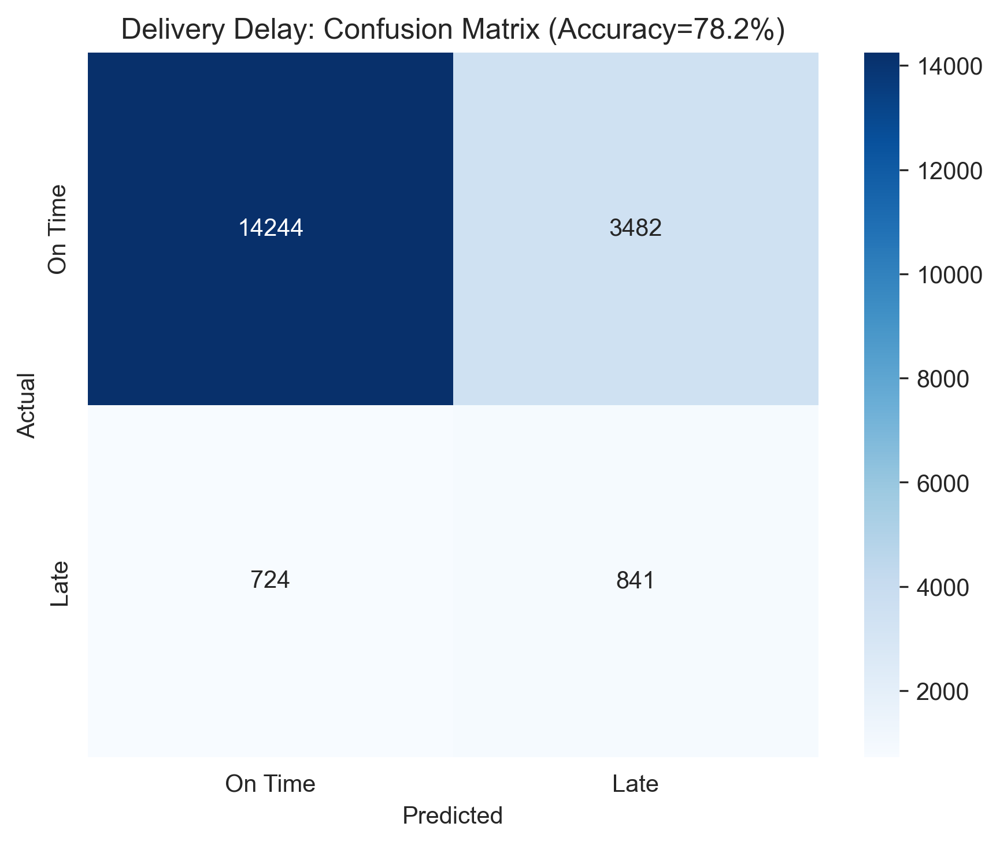
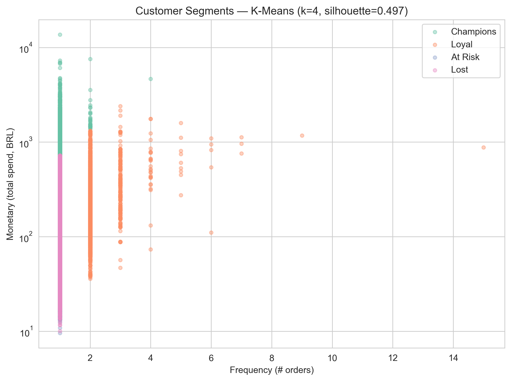

# Scalable E-Commerce Analytics Pipeline

> **A serverless AWS data pipeline and Python engine processing 100k+ records across 8 relational datasets — analytics, machine learning, and interactive dashboards for Customer Lifetime Value (CLV) and Retention.**


---

## 📊 Project Overview

| Metric | Value |
|---|---|
| **Status** | ✅ Complete |
| **Total Orders** | 99,440 |
| **Total Revenue** | R$16,081,420.74 |
| **Unique Customers** | 96,095 |
| **Avg Order Value** | R$161.72 |
| **Repeat Customer Rate** | 3.12% |
| **On-Time Delivery Rate** | 91.89% |
| **Analyses** | 7 statistical + 3 ML models |
| **Dashboards** | 1 interactive (Plotly) + Power BI exports |
| **Dataset** | [Olist Brazilian E-Commerce](https://www.kaggle.com/datasets/olistbr/brazilian-ecommerce) |

---

## 🎯 Business Impact & Strategy
This project transitions from local data processing to a **Cloud-Native Architecture**, simulating the scalability required in high-volume retail environments:

* **Retention Engineering:** Built a **Longitudinal Cohort Matrix** and discovered the real retention story isn't gradual drop-off — it's that only **3.12%** of customers ever place a second order. That reframes the whole retention strategy: the highest-leverage move is converting first-time buyers into second-time buyers at all, not slowing month-over-month decay.
* **Predictive Segmentation:** Automated an **RFM (Recency, Frequency, Monetary) Model** across 96k+ unique customers. The "Champion" segment spends **~2.1x** the average customer by quintile scoring, or **~7x** under a stricter K-Means clustering — both reported honestly rather than picking whichever number sounds better (see [docs/PROJECT_SUMMARY.md](docs/PROJECT_SUMMARY.md)).
* **Machine Learning:** Trained models to predict delivery delays (Random Forest, ROC-AUC 0.737) and review scores (R²=0.216) directly from order features, and to cluster customers via K-Means on RFM (silhouette 0.497).
* **Cost-Optimized Scalability:** Architected a serverless Data Lake on **AWS**, decoupling storage from compute to enable high-velocity SQL querying with **near-zero infrastructure overhead**.

---

## 📁 Project Structure

```
Scalable-E-commerce-Analytics-Pipeline/
├── ecommerce_analysis.py      # Core pipeline: load → merge → 7 statistical analyses
├── ml_models.py                # 3 ML models: delivery delay, review score, RFM clustering
├── dashboard.py                 # Builds the interactive Plotly dashboard
├── power_bi_exports.py          # Writes pre-aggregated CSVs for Power BI
├── data/
│   └── raw/                    # Olist CSVs (gitignored — fetch via Kaggle, see Quick Start)
├── visualizations/              # Output of ecommerce_analysis.py (7 charts)
├── ml_models/                   # Output of ml_models.py (6 charts + summary report)
├── dashboard/
│   └── index.html               # Interactive Plotly dashboard (open directly in a browser)
├── power_bi/
│   ├── exports/                 # 8 CSVs ready to import into Power BI Desktop
│   └── olist_dashboard.pbix     # (build this yourself — see docs/POWERBI_GUIDE.md)
├── docs/
│   ├── PROJECT_SUMMARY.md       # Methodology deep-dive, verified metrics, findings
│   └── POWERBI_GUIDE.md         # Step-by-step guide to building the Power BI dashboard
├── .github/workflows/ci.yml     # Data quality / pipeline validation CI
├── requirements.txt
└── README.md
```

---

## 🚀 Quick Start

### Local Workflow (Python)
1. **Clone the repository**
   ```bash
   git clone https://github.com/rithikahaha/Scalable-E-commerce-Analytics-Pipeline.git
   cd Scalable-E-commerce-Analytics-Pipeline
   ```
2. **Get the data** — download the [Olist Dataset from Kaggle](https://www.kaggle.com/datasets/olistbr/brazilian-ecommerce) (via the website, or `kaggle datasets download -d olistbr/brazilian-ecommerce --unzip`) and place the CSVs in `data/raw/`.
3. **Install dependencies**
   ```bash
   pip install -r requirements.txt
   ```
4. **Run the pipeline**
   ```bash
   python ecommerce_analysis.py     # 7 statistical analyses -> visualizations/
   python ml_models.py              # 3 ML models -> ml_models/
   python dashboard.py              # interactive dashboard -> dashboard/index.html
   python power_bi_exports.py       # Power BI CSVs -> power_bi/exports/
   ```
   Each script prints its own executive summary to the console.

### Cloud Workflow (AWS)
Upload `raw_data/` to **S3** → run the **Glue Crawler** to populate the Data Catalog → query via **Athena** SQL.

---

## ☁️ CI/CD Pipeline

This project includes an automated CI pipeline using **GitHub Actions** that runs on every push to `main`.

**Automated checks on every commit:**
- Dependency validation — confirms all libraries load correctly
- Function existence check — verifies core pipeline functions are present
- Schema validation — checks required columns exist in the data
- Null value detection — flags missing data in critical fields
- Data integrity check — catches negative payment values

---

## 🛠️ Tech Used

| Category | Tools |
|---|---|
| **Cloud Storage** | Amazon S3 — scalable object storage for the 8-table Data Lake |
| **Cloud ETL** | AWS Glue — serverless crawlers for cataloging and schema discovery |
| **Cloud Query Engine** | Amazon Athena — interactive ANSI SQL directly over S3 |
| **Data Processing** | Python, Pandas, NumPy |
| **Machine Learning** | Scikit-learn (Random Forest, K-Means) |
| **Visualization** | Matplotlib, Seaborn, Plotly |
| **Dashboards** | Plotly (interactive HTML), Power BI |
| **DevOps** | GitHub Actions (CI), Bash |

---

## ⚙️ Technical Implementation

**1. Cloud Data Engineering (AWS - Mumbai Region)**
* **Storage:** Established a centralized landing zone for 8 datasets (Orders, Payments, Customers, Reviews, etc.) ensuring 99.999999999% durability.
* **ETL Logic:** Orchestrated Glue Crawlers to automatically populate the **Glue Data Catalog**, creating a structured metadata layer for the raw CSVs.
* **Serverless SQL:** Optimized Athena queries for "Frugality" by using column projection to minimize data scanned per query.

**2. Analytics Pipeline (Python)**
* **Data Wrangling:** Executed multi-key joins across sources to create a **Single Source of Truth**.
* **Modeling:** Developed custom logic for **Cohort Analysis** and **RFM Statistical Binning** using `pd.qcut`.

**3. Machine Learning (`ml_models.py`)**
* **Delivery Delay Prediction:** Random Forest Classifier with balanced class weights (only ~8% of orders are late — an unweighted model can hit ~92% "accuracy" by always predicting on-time, which is useless operationally).
* **Review Score Prediction:** Random Forest Regressor over price, freight, and delivery-timing features.
* **Customer Segmentation:** K-Means (k=4) on standardized RFM features, validated with a silhouette score.

**4. Dashboards**
* **Interactive (`dashboard.py`):** Self-contained Plotly HTML — KPIs, revenue trend, state breakdown, payment mix. No server required.
* **Power BI (`power_bi_exports.py`):** 8 pre-aggregated CSVs plus a full build guide in [`docs/POWERBI_GUIDE.md`](docs/POWERBI_GUIDE.md).

Full methodology and per-analysis breakdown: **[docs/PROJECT_SUMMARY.md](docs/PROJECT_SUMMARY.md)**

---

## 📈 Key Insights

| Insight | Finding |
|---|---|
| Payment infrastructure | **73.9%** of transactions are via Credit Card |
| Regional concentration | São Paulo alone drives **37.5%** of total revenue |
| Satisfaction vs. loyalty | Weak correlation (r≈0.038) — satisfied ≠ repeat customer |
| Repeat purchase rate | Only **3.12%** of customers order more than once |
| RFM segmentation | "Champion" segment spends **2.1x–7x** the average, depending on segmentation strictness |
| Delivery → satisfaction | Lateness is the strongest single predictor of review score |
| Delivery delay model | Random Forest, ROC-AUC **0.737**, recall 53.7% on late deliveries |
| Review score model | Random Forest Regressor, R²=**0.216**, RMSE 1.14 stars |

Details, methodology, and limitations: **[docs/PROJECT_SUMMARY.md](docs/PROJECT_SUMMARY.md)**

---

## 🖼️ Deep-Dive Visual Analytics

**1. Cohort Retention Analysis**
Tracked customers by first-purchase month. The real story: retention isn't a gradual decline, it's a near-vertical cliff — almost every cohort reads 0% by month 1, because 96.9% of customers never come back at all.


**2. Revenue Growth Trajectory**
Monthly revenue over time, showing growth from the platform's 2016 launch through its 2018 peak.


**3. Distribution of Customer Lifetime Value (CLV)**
Customers split into Low/Medium/High/VIP quartiles by total spend.


**4. Payment Infrastructure Analysis**
**73.9% of transactions are via Credit Card** — the single highest-leverage payment gateway to keep reliable.


**5. Regional Market Concentration**
São Paulo alone drives over a third of total revenue; visualizes which smaller states "punch above their weight."


**6. Satisfaction vs. Loyalty Paradox**
Statistical proof that **"Satisfied" does not reliably predict "repeat buyer"** in this marketplace (r≈0.038).


**7. RFM Behavioral Segmentation**
Customers labeled **Champion, Loyal, At Risk, or Lost** by quintile RFM scoring.


### Machine Learning

**8. Delivery Delay Model — Confusion Matrix**


**9. Customer Segmentation — K-Means on RFM**
A stricter, algorithmically-clustered alternative to the quintile RFM segments above.


Full model outputs (ROC curve, feature importances, actual-vs-predicted): [`ml_models/`](ml_models/)

### Dashboards

**Interactive dashboard:** open [`dashboard/index.html`](dashboard/index.html) directly in a browser for a hoverable, explorable version of the KPIs and charts above.

**Power BI:** pre-built CSV exports and a full build guide live in [`power_bi/`](power_bi/) — see [docs/POWERBI_GUIDE.md](docs/POWERBI_GUIDE.md).

---

## 📚 Documentation

- **[docs/PROJECT_SUMMARY.md](docs/PROJECT_SUMMARY.md)** — dataset details, verified metrics, per-analysis methodology, ML model results, key findings, and known limitations
- **[docs/POWERBI_GUIDE.md](docs/POWERBI_GUIDE.md)** — step-by-step guide to building the Power BI dashboard from the provided CSV exports

---

## 💡 What I Learned (Key Takeaways)
* **Cohorts can reveal something more fundamental than a retention curve.** I expected the cohort matrix to show gradual month-over-month decay. It showed a cliff instead — a sign the underlying business model (a multi-seller marketplace) doesn't produce repeat buyers the way a single-brand retailer would. The technique surfaced a structural insight, not just a metric.
* **A headline stat is only as good as its denominator.** The "Champion segment spends Nx the average" claim changes by more than 3x (2.1x vs 7x) depending on whether segments come from quintile binning or K-Means clustering. Reporting both, with the method that produced each, is more honest than picking the more impressive-sounding one.
* **Accuracy is the wrong metric for imbalanced classification.** With only ~8% of orders late, an unweighted classifier hits ~92% "accuracy" by never predicting "late" at all — which is exactly the failure mode a delay-prediction model exists to avoid. Balancing for recall on the minority class is the right call even though it looks worse on paper.
* **RFM > Total Spend:** Scoring customers on **Recency** is eye-opening; a customer who bought recently for a small amount is often more valuable than someone who spent a lot two years ago.

---

## 🗺️ Future Roadmap
* **Automated ETL:** Use **AWS Lambda** triggers to run the Glue Crawler automatically when new data lands in S3.
* **Data Quality Gates:** Implement **AWS Glue Data Quality** to catch "dirty" data before it reaches the analytics layer.
* **First-Purchase-to-Second-Purchase Funnel:** Given how rare repeat purchases are, a natural next model is predicting which first-time buyers are likeliest to return — more actionable here than a churn model.
* **Finish the Power BI Build:** The CSV exports and guide are ready; build and commit the actual `.pbix` (see [docs/POWERBI_GUIDE.md](docs/POWERBI_GUIDE.md)).

---

## 📧 Author
**Rithika Harikrishna**
[LinkedIn](https://linkedin.com/in/rithika-harikrishna) · [GitHub](https://github.com/rithikahaha)
